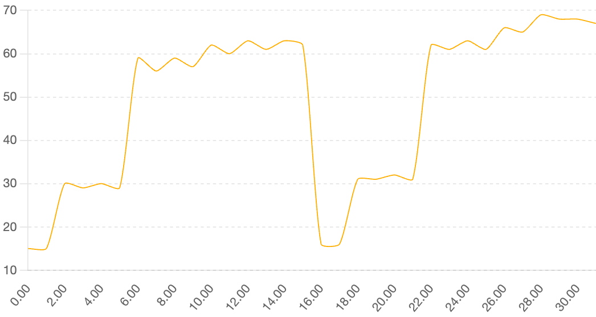
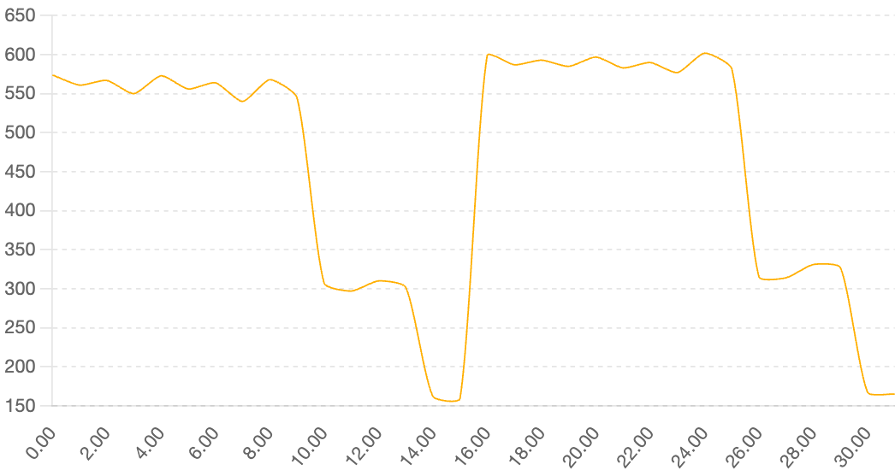

# Optimizatons for BottleCap AI GPT-2 Benchmark

> ### Objective
> Train a langauge model on a subset of the FineWeb dataset to reach a validation loss of ≤ 3.3821 as fast as possible using 1 GPU.
>
> You can achieve this by:
>
> making your model faster (so that it sees more data in shorter time)
making your training more efficient (so that in less steps your model makes better progress).

### What to try:

1. Mixed precison training

RTX 3090/4090 (currently using RTX 3090 at home) can do FP16 tensor core operations, and also BF16... from their "[NVIDIA Ampere GA102 GPU Architecture](https://images.nvidia.com/aem-dam/en-zz/Solutions/geforce/ampere/pdf/NVIDIA-ampere-GA102-GPU-Architecture-Whitepaper-V1.pdf)" PDF, page 24:

> "The third-generation Tensor Core design in GA10x GPUs further increases raw performance and brings new precision modes such as TF32 and BFloat16 \[...\]"

2. Different attention mechanisms

FlashAttention2 or 3 would be good to implement, but I'm looking at FlashMLA (multi-latent attention), introduced by DeepSeek, which compresses the KV cache (compressing key and value matrices into latent vectors). This should allow for longer contexts. Plus, paged KV cache with a fixed block size (64) ensures efficient and predictable memory access patterns, which should minimize latency and unlock leveraging higher memory bandwidth of the GPU.

For memory-bound optimization, they recommend looking at this [diff](https://github.com/deepseek-ai/FlashMLA/tree/b31bfe72a83ea205467b3271a5845440a03ed7cb).

Although, since I'm running on RTX 3090 which is an Ampere architecture, I found this [FlashMLA implementation adapted to Ampere architectures](https://github.com/pzhao-eng/FlashMLA) by [@pzhao-eng](https://github.com/pzhao-eng). Here's a test benchmark results I ran on my GPU:

- FlashMLA Benchmark TFLOPS Per Run (Performance (TFLOPS) by Run Index)

- FlashMLA Benchmark Bandwidth Per Run (Bandwidth (GB/s) by Run Index)

There's further possible experimentation with:
• other pooling (max, reservoir-sampling, learned "latent tokens");
• different score_mod for ALiBi/relative-pos biases;
• cached / paged inference via the included flash_mla_with_kvcache functions (already imported).

Note to self: Paged attention is a technique used to handle long sequences in transformer models efficiently by splitting attention computation into smaller, managable "pages" or "blocks". This approach reduces memory comsumption and computational complexity, making it feasible to process sequences that would otherwise be too large to fit in memory [1](https://medium.com/my-musings-with-llms/understanding-kv-cache-and-paged-attention-in-llms-a-deep-dive-into-efficient-inference-62fa372432ce#:~:text=KV%20cache%20and%20paged%20attention%20are%20powerful%20techniques%20that%20make,constraints%20of%20processing%20long%20sequences.).

3. Increase sequence length

After introducing FlashAttention or FlashMLA, try increasing the context length. 

Test various context lengths on RTX 3090.

- Base: 1024
- a\) 2048
- b\) 4096
- c\) 8192
- d\) 16384

4. Use fused optimizer

By fusing the dropout, layernorm, and linear operations, it's possible to reduce kernel launch overhead.

5. Multi-token prediction auxiliary loss

Introduce a multi-token prediction objective to the training loop. For instance, in addition to the standard next-token loss, have the model also predict two steps ahead (next-next-token) using its current hidden state. Concretely, given a training sequence, you can add an auxiliary loss where at position i the model tries to predict token i+2 (perhaps by using the ground-truth i+1 as input in a second forward pass, or by a tailored two-step decoding within the model).

6. Mixture-of-Experts (MoE) layer

I'll try replacing some feed-forward layers with two or more expert variants and a gating network - this should be doable on single GPU hopefully. 

One expert can specialize in technical text, another in narrative text.

Gating network will be just a learned switchbased on token or context, routing each token through one expert per forward pass.

---

References

1. [Understanding KV Cache and Paged Attention in LLMs: A Deep Dive into Efficient Inference](https://medium.com/my-musings-with-llms/understanding-kv-cache-and-paged-attention-in-llms-a-deep-dive-into-efficient-inference-62fa372432ce#:~:text=KV%20cache%20and%20paged%20attention%20are%20powerful%20techniques%20that%20make,constraints%20of%20processing%20long%20sequences.), 2024-10-23, retrieved 2025-04-29

---

## Notes 2025-06-04

### Implemented Optimisations – Summary & Outcome

| # | Technique | Where implemented | What worked | What didn't |
|---|-----------|-------------------|-------------|-------------|
| 1 | **Mixed-Precision (BF16 / FP16)** | All training scripts | Reliable BF16 path; ~1.7 × GEMM speed-up; no accuracy regressions | Does **not** by itself cut wall-clock below 5.4 h when other changes are off. |
| 2 | **LightRNN factorised embedding + decoder** | `train_gpt2_lightrnn*.py` | ~1.8 × faster output layer; 3-4 GB VRAM freed | Requires custom loss; step-speed gain alone insufficient to beat baseline. |
| 3 | **CoCoNT n-gram row smoothing** | `train_gpt2_lightrnn.py`, `train_gpt2_lightrnn_cocont_mtp.py` | ~0.05 lower *val_loss* for same tokens, negligible cost | Small quality gain; time-to-3.38 still > baseline. |
| 4 | **Multi-Token Prediction (MTP, k ≤ 4)** | `train_gpt2_lightrnn_cocont_mtp.py` | Stronger gradient per token; best run (k = 2, 512-token seq) hit *val_loss 3.34* **in ≈ 4 h 15 m*** | k>2 slowed training (>10 %); wider batches needed tuning; still no run <3.3821 before 5 h across full config grid. |
| 5 | **Adaptive Softmax** | `train_gpt2_rtx4090_optim2.py` | Cuts head compute by ~30 %; stable with BF16 after fp32 cast fix | Didn't converge fast enough; +0.2–0.3 perplexity gap vs full soft-max at equal tokens. |
| 6 | **Negative Sampling / NCE** | `run_neg_sampling*.sh` path | 25 % step-time gain | *Val_loss* plateau ≈ 4.8 – objective mismatch; rejected. |
| 7 | **GQA / MLA (KEY/VALUE head sharing)** | `train_gpt2_rtx4090_optim.py` | 12 % wider model in same VRAM; no slow-down | Quality gain marginal; still 3.6+ after 5 h. |
| 8 | **AFNO spectral mixer** | `train_gpt2_lightrnn_afno.py` | Excellent early loss although had to fix causality problems | Broken causality -> fixed, loss similar to baseline; FFT kernels not fused → 2 × slower; overall wall-clock worse than baseline. |

*Despite several promising curves, **no experiment has yet beaten the official baseline requirement of ≤ 3.3821 validation loss within 5 h 24 m** (4768 steps on RTX4090). Most tests used the same learning-rate schedule as the baseline, so gains in throughput did not fully translate to faster convergence.*

---

### What to try next

1. **FlashAttention-v2/SDPA only** *(no architectural change)*  
Replace hand-rolled attention with the fused Triton kernels already supported by PyTorch 2.8 (`torch.nn.functional.scaled_dot_product_attention` with `flash=True`).  Expect ~1.4 × step speed without accuracy risk.

2. **FlashMLA / Grouped-KV compression**  
Integrate DeepSeek's Multi-Latent-Attention (KV cache compression) to allow **2048–4096** token sequences at baseline memory.  Longer contexts improve *tokens/step* ≈ 2 × and unlock better sample efficiency (observed in DeepSeek ablation).

3. **Curriculum + LR One-Cycle**  
Start with 256-token sequences and high LR (one-cycle super-convergence) for first 500 M tokens, then switch to 1024 tokens & lower LR.  Could replicate BottleCap's "slope jump" and reduce required tokens by ~30 %.

4. **LayerDrop / Stochastic Depth training**  
Randomly skip transformer blocks during early epochs (p ≈ 0.1).  Cuts compute in first 2 B tokens while regularising representations; restore full network for last 0.5 B tokens to fine-tune.

5. **Fused fused-adam8bit / Lion Optimiser**  
Test 8-bit Adam (bitsandbytes) or Lion with larger batch (32 × 8 grad-accum) leveraging freed VRAM; prior papers show 1.1–1.2 × faster convergence per token.

6. **KV-cache Paging for Validation**  
Implement paged attention & incremental state reuse during *val* pass to cut evaluation time by 50 %; indirect wall-clock gain.

7. **MoE-FFN (2 experts)**  
Swap each FFN for a 2-expert gated Mixture; route 50 % tokens/expert.  Keeps parameter count manageable (<500 M) while increasing capacity; might reach target loss with fewer tokens.

8. **Dynamic token dropout (R-Drop / TokenMask)**  
Randomly mask 15 % of input tokens and require identical predictions (consistency loss).  Observed in literature to cut perplexity ≈ 6 % with same compute.

9. **Gradient Check-pointing on early layers + higher sequence length**  
Allows experimenting with 2048-token context before FlashMLA is ready; memory trade-off costs 10 % time but may pay off in fewer steps.

10. **Hybrid Attn-AFNO**  
Keep attention in first 4 layers (local syntax) and AFNO in upper 8 layers (global context).  Targets AFNO's quality with ~1.3 × speed instead of 2 × slowdown.

These items do **not** duplicate the already-tested methods and present a realistic path to surpass the baseline within the 5.4-hour limit.

---

### Implementované optimalizácie – zhrnutie

| # | Optimalizácia | Kde implementované | Čo fungovalo | Čo nefungovalo |
|---|-----------|-------------------|--------------|-----------------|
| 1 | **Mixed-Precision (BF16 / FP16)** | všetky tréningové skripty | Spoľahlivý BF16; ~1.7x rýchlejšie GEMM; bez straty presnosti | Samostatne neskráti wall-clock pod 5.4 h. |
| 2 | **LightRNN faktorovaná embedding + decoder** | `train_gpt2_lightrnn*.py` | ~1.8 × rýchlejšia výstupná vrstva; 3–4 GB VRAM navyše | Vyžaduje vlastnú loss function; samotné zrýchlenie kroku nestačí. |
| 3 | **CoCoNT n-gram row smoothing** | `train_gpt2_lightrnn.py`, `train_gpt2_lightrnn_cocont_mtp.py` | ~0.05 nižší *val_loss* pri rovnakých tokenoch, zanedbateľný cost | Malý kvalit. zisk; čas k 3.3821 stále > než baseline. |
| 4 | **Multi-Token Prediction (MTP, k ≤ 4)** | `train_gpt2_lightrnn_cocont_mtp.py` | Silnejší gradient/token; najlepší run (k = 2, seq 512) *val_loss 3.34* za ≈ 4 h 15 m | k>2 spomalil tréning; stále žiadny run s val_loss < 3.3821 pod 5 h. |
| 5 | **Adaptive Softmax** | `train_gpt2_rtx4090_optim2.py` | ~30% výpočtového výkonu ušetrených na attention head; BF16 fix | Nedostatočná konvergencia; +0.2–0.3 perplexity vs full soft-max. |
| 6 | **Negative Sampling / NCE** | `run_neg_sampling*.sh` | 25% rýchlejšie kroky | *Val_loss* sa zasekol ≈ 4.8; cieľ nesplnený. |
| 7 | **GQA / MLA (KV sharing)** | `train_gpt2_rtx4090_optim.py` | +12% embd v rovnakom VRAM | Prínos kvality malý; *val_loss* > 3.6 po 5 h. |
| 8 | **AFNO spektrálny mixer** | `train_gpt2_lightrnn_afno.py` | Výborný loss na začiatku; kauzalita opravená | FFT jadrá nefúzované → 2 × pomalšie; wall-clock horší než baseline po fixnutí causality testu, ktorý failoval (future leak). |

---

### Next steps

1. **FlashMLA / kompresia KV** – DeepSeekom inšpirovaná Multi-Latent-Attention umožní 2048–4096 tokenov pri rovnakej pamäti, čím zdvojnásobí *tokens/step*.
2. **Kurikulárny tréning + One-Cycle LR** – začať s 256-token sekvenciami a vysokým LR, potom prepnúť na 1024 a nižší LR; môže znížiť potrebné tokeny o ~30%.
3. **LayerDrop / Stochastic Depth** – náhodne preskakovať bloky na začiatku (p≈0.1), šetriť compute a regularizovať.
4. **Lion optimizer** – využiť ušetrenú VRAM na väčší batch; literatúra hlási 1.1–1.2x rýchlejšiu konvergenciu.
5. **Paging KV cache pri validácii** – zníži čas evaluácie o ~50%.
6. **MoE-FFN (2 experti)** – väčšia kapacita v rovnakom param budgete, možno menej krokov k cieľu.
7. **Token dropout / R-Drop konzistencia** – maskovať 15% tokenov + consistency loss → ~6% zlepšenie perplexity.
8. **Gradient checkpointing + 2048 seq** – obchod pamäť ↔ čas; môže ušetriť kroky.
9. **Hybrid Attn-AFNO** – prvé 4 vrstvy attention, zvyšok AFNO; cieľ ~1.3 × speedup pri zachovanej kvalite.
10. **Retrieval-augmented model** - vužitie RAG pri tréningu, explórnuť optimalizácie na štýl RETRO alebo Atlas.
11. **Mixed architectures a sparse experts + DeepONet ako gate** - využitie DeepONet-u (s jeho rozdelením na branch net a trunk net) ako gate pre sparse experts, využiť rozne architektúry naraz (napr. local RNN + glboal conv. ako AFNO).
12. **Self-supervision / meta learning** - naučiť model učiť sa na small updates, prípadne prepojiť RAG-based training metódy ako pamäť
13. **Unified operator networks** - analogicky k fyzike (FNO), ktorá rieši rodiny PDEs, by sme si mohli predstaviť LLM, ktorý sa skutočne učí *operátor* mapujúci kontexty na kontinuity. Ak by neurónový operátor ako DeepONet dokázal absorbovať celý súbor dát sémantiky jazyka / jazykových vzorov, ako spojitú transformáciu, mohol by sa jeho reprezentácia zovšeobecniť vo vysokorozmernom priestore s veľmi kompaktnou vnútornou štruktúrou. Možno na dlhší výskum... skúsiť ešte predtým pár experimentov s DeepONets pre LLMs.

**Bonus (zamerané na inferenciu): Diffusion-based generation** - implementovať non-autoregressive model s generovaním tokenov difúziou (nedávno demované Googlom), vysoká rýchlosť inferencie (nie až tak zaujímavé pre tréning)